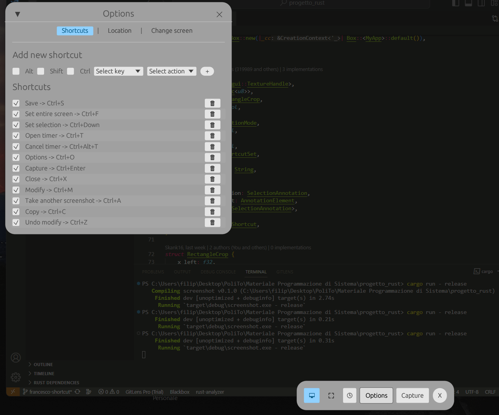
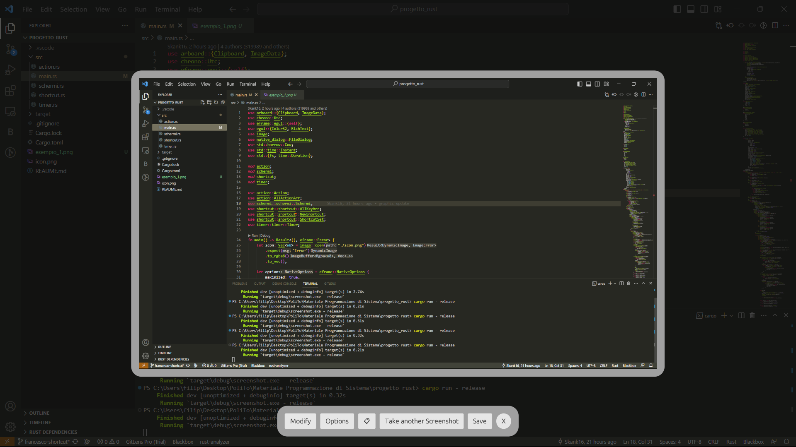

# RUST GRAB UTILITY 🦀
Developed by Filippo Castellarin (308692), Francesco Gallo (319989), and Andrea Scamporrino (318927) for the System Programming course at the Polytechnic University of Turin (A.Y 2022/2023)

## Crates
- **screenshots**: [lib.rs/crates/screenshots](https://lib.rs/crates/screenshots)
- **egui**: [docs.rs/egui/latest/egui/](https://docs.rs/egui/latest/egui/) (GitHub: [github.com/emilk/egui.git](https://github.com/emilk/egui.git))
- **native-dialog**: [docs.rs/native-dialog/latest/native_dialog/](https://docs.rs/native-dialog/latest/native_dialog/)
- **arboard**: [lib.rs/crates/arboard](https://lib.rs/crates/arboard)
- **chrono**: [lib.rs/crates/chrono](https://lib.rs/crates/chrono)
- **image**: [lib.rs/crates/image](https://lib.rs/crates/image)

## Features
1. [x] **Platform Support**: The app can be used on all platforms.
2. [x] **User Interface (UI)**: Easily navigable user interface.
3. [x] **Selection Options**: Screen selection box to crop the screen portion to capture.
4. [x] **Hotkey Support**: Ability to use keyboard shortcuts for operations.
5. [x] **Output Format**: Various supported formats for screen capture (png, jpg, gif). Saving also to device clipboard.
<!-- BONUS FEATURES -->
6. [x] **Annotation Tools**: Tools to draw on the captured screen image and save annotations.
7. [x] **Delay Timer**: Through the interface, the user can set the delay after which the screen will be captured.
8. [x] **Save Options**: A file system dialog window opens, allowing the user to choose the name (if different from default) and format of the image.
9. [x] **Multi-monitor Support**: Ability to capture screens from connected monitors.

## Usage Example

- `🖵`: Capture the entire screen
- `⛶`: Capture only the framed screen portion
- `🕓`: Set a timer
- `Capture`: Execute a screenshot
- `Options`: Open the panel to modify options
- `Modify`: Open the annotation tool to edit the image
    * `🖊`: Freehand drawing
    * `/`: Draw a segment
    * `↖`: Draw an arrow
    * `☐`: Draw a rectangle
    * `⭕`: Draw a circle
    * `Text`: Add text to the image (confirmation of addition required by `Save text`)
    * `⟲`: Undo the last modification
    * `⛶`: Crop the image (confirmation of cropping required by `Save crop`)
    * `Cancel`: Undo all changes made to the image
    * `Save modify`: Permanently save all changes made to the image

- `📋`: Copy the image to the device clipboard
- `Take another screenshot`: Allow taking another screenshot by clearing the current image and modifications
- `X`: Close the application

## Default Saving Path
- `./screenshots`

## Default Shortcuts
- `ctrl+F`: Set full-screen capture
- `ctrl+ArrowDown`: Set capture to a screen selection
- `ctrl+T`: Display timer options
- `ctrl+shift+T`: Start the timer countdown if configured, otherwise open the timer options
- `ctrl+alt+T`: Cancel an ongoing timer
- `ctrl+O`: Display options
- `ctrl+enter`: Execute a screenshot
- `ctrl+X`: Close the application
- `ctrl+M`: Display image modification options once captured
- `ctrl+A`: Execute another screenshot
- `ctrl+S`: Save the image
- `Ctrl+C`: Copy the image
- `Ctrl+Z`: Undo the last image modification
- Note: Shortcut selection keys vary depending on the operating system in use: ctrl corresponds to cmd for macOS.
